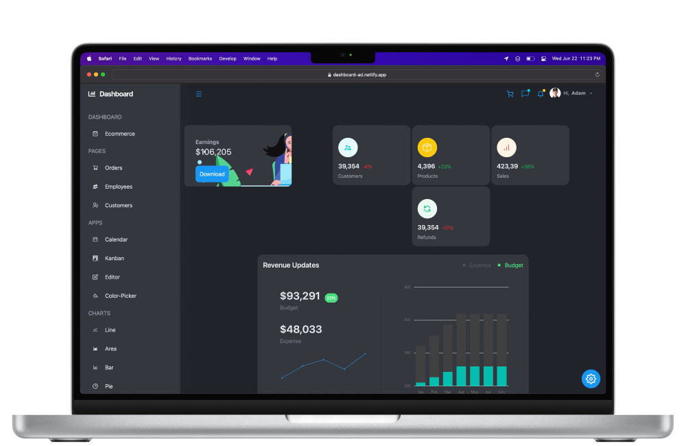

# Dashboard 📊

The aim of this admin panel project was simple: further my experience with React and demonstrate that I can build the types of things for which companies have an actual use.

The Syncfusion components were relatively easy to implement, but the general size of this website was the main eye-opener for me: About two dozen components came together to form my largest React project to date.

## To Do ✅

I could customize some of the data that powers the charts, but the `dummy.js` file provided by a tutorial is 5,838 lines long, and I've already changed enough to make it my own. Besides, the purpose of this project is the modern design and functionality — not the somewhat random chart data.

## Author 👨🏻‍💻

- Aaron Durant // [aarondurant.com](https://aarondurant.com) // [@AaronRDurant](https://twitter.com/AaronRDurant)
